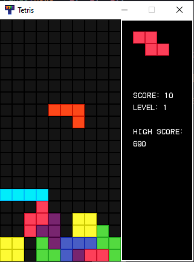

# Tetris

A Tetris Clone made using [pygame](https://www.bing.com/ck/a?!&&p=74e1266fc3ffab59e47fe701f66be7a0949ca5812d3cd7e68642a743535fddedJmltdHM9MTczMjQ5MjgwMA&ptn=3&ver=2&hsh=4&fclid=3847e616-8fde-65b6-3f9c-f3018ecc6493&psq=pygame&u=a1aHR0cHM6Ly93d3cucHlnYW1lLm9yZy9kb2NzLw&ntb=1)

- **Download release**, **extract**, open **cmd** (Windows) or **Terminal** (macOS/Linux) in the project folder and run

## Linux (Arch), macOS

```sh
python -m venv venv
source venv/bin/activate
pip install -r requirements.txt
python app.py
```

## Windows

```sh
python -m venv venv
venv\Scripts\activate
pip install -r requirements.txt
python app.py
```

3. Run `main.py` to run the game.
4. Control: 
  - Use <kbd>&uarr;</kbd> or <kbd>w</kbd> to rotate tetrimino, 
  - Use <kbd>&darr;</kbd> or <kbd>s</kbd> to quick place,
  - Use <kbd>&larr;</kbd> or <kbd>a</kbd> to moving left,
  - Use <kbd>&rarr;</kbd> or <kbd>d</kbd> to moving right

## Screenshot


